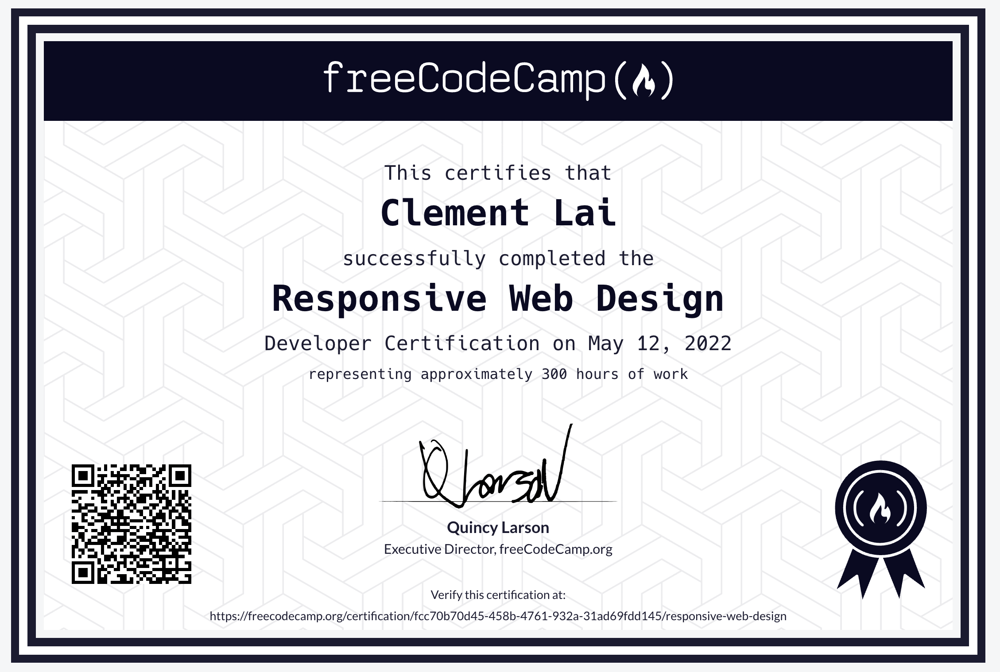

# Responsive-web-design
FreeCodeCamp Responsive Web Design Certification, highlighting HTML and CSS skills. Explore projects from a humble tribute page to a personal portfolio, each passing automated test suites. Demonstrates a commitment to responsive and visually appealing web design.

## Projects

### 1. Tribute Page
- **Description:** A tribute page to honor someone I admire.
- **Link:** [Tribute Page](https://codepen.io/mrwednesday33/full/rNJeONK)

### 2. Survey Form
- **Description:** A responsive survey form.
- **Link:** [Survey Form](https://codepen.io/mrwednesday33/pen/abqNPjZ)

### 3. Product Landing Page
- **Description:** A landing page for showcasing a product or service.
- **Link:** [Product Landing Page](https://codepen.io/mrwednesday33/full/RwQRgXR)

### 4. Technical Documentation Page
- **Description:** Documentation page for a technology or programming language.
- **Link:** [Technical Documentation Page](https://codepen.io/mrwednesday33/pen/PoQGPNY)

### 5. Personal Portfolio
- **Description:** My personal portfolio showcasing the projects I've worked on.
- **Link:** [Personal Portfolio](https://codepen.io/mrwednesday33/full/dydppeX)

## Certification

